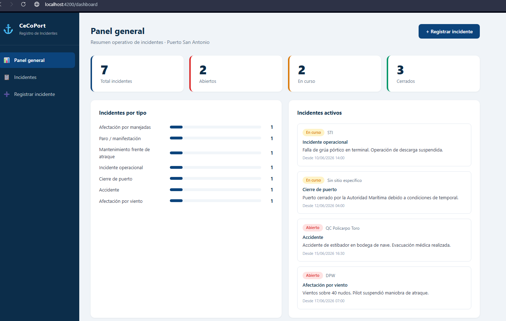
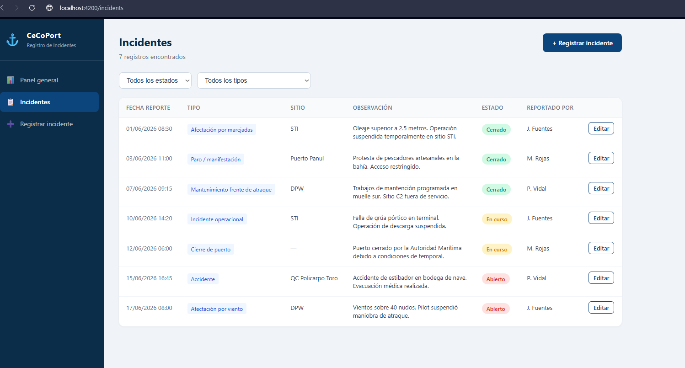
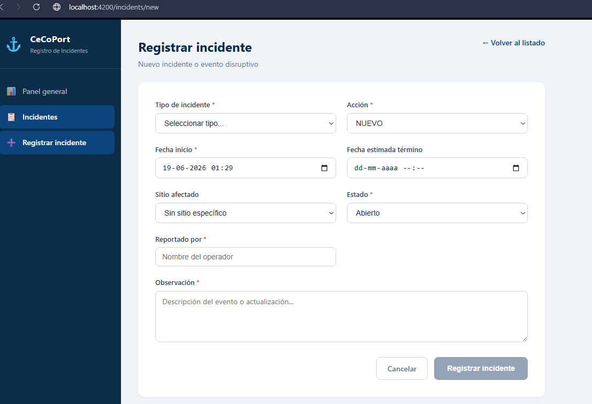

# CeCoPort · Registro de Incidentes (MVP)

Prototipo funcional en Angular para el registro y gestión de incidentes de planificación naviera.

Este proyecto usa **datos de ejemplo (mock)** en memoria

---

## 📋 Qué incluye

- **Panel general** — KPIs de incidentes (total, abiertos, en curso, cerrados), distribución por tipo y listado de incidentes activos.
- **Listado de incidentes** — tabla con filtros por estado y tipo.
- **Formulario de registro/edición** — alta de nuevos incidentes y actualización de existentes.

---

## 🚀 Cómo levantar el proyecto

### Requisitos previos

- [Node.js](https://nodejs.org/) (versión 18 o superior)
- npm (se instala junto con Node.js)

### Instalación

1. Clona el repositorio:
   ```bash
   git clone https://github.com/mvaldiviah-sketch/cecoport-incidentes-mvp.git
   cd cecoport-incidentes-mvp
   ```

2. Instala las dependencias:
   ```bash
   npm install
   ```

3. Levanta el servidor de desarrollo:
   ```bash
   npx ng serve
   ```

4. Abre el navegador en:
   ```
   http://localhost:4200
   ```


## 🛠️ Stack técnico

- **Angular 17** (standalone components, signals)
- **TypeScript**
- Sin dependencias de UI externas (estilos hechos a mano por componente)

## 📄 Contexto

Este prototipo forma parte de una propuesta técnica para el caso de prueba "Especialista en Desarrollo de Sistemas para Soluciones Logísticas" de EPSA, orientada a resolver la falta de trazabilidad en el registro actual de incidentes (hoy gestionado en planillas Excel no estructuradas).

## 📸 Capturas de pantalla
### Panel general
### este panel es el sprincipal del sistema, acá tambien se muestran las estadisticas de forma mas superficial, recordar que el detalle mas grande iria en power BI.



### Incidentes
### acá va el panel de incidentes, listando los incidentes registrados y sus respectivos estados hasta el momento en el sistema .



### Nuevos Incidentes
### acá va la inserción de nuevos incidentes en el sistema, donde sale el formulario con los datos necesarios para su registro.


